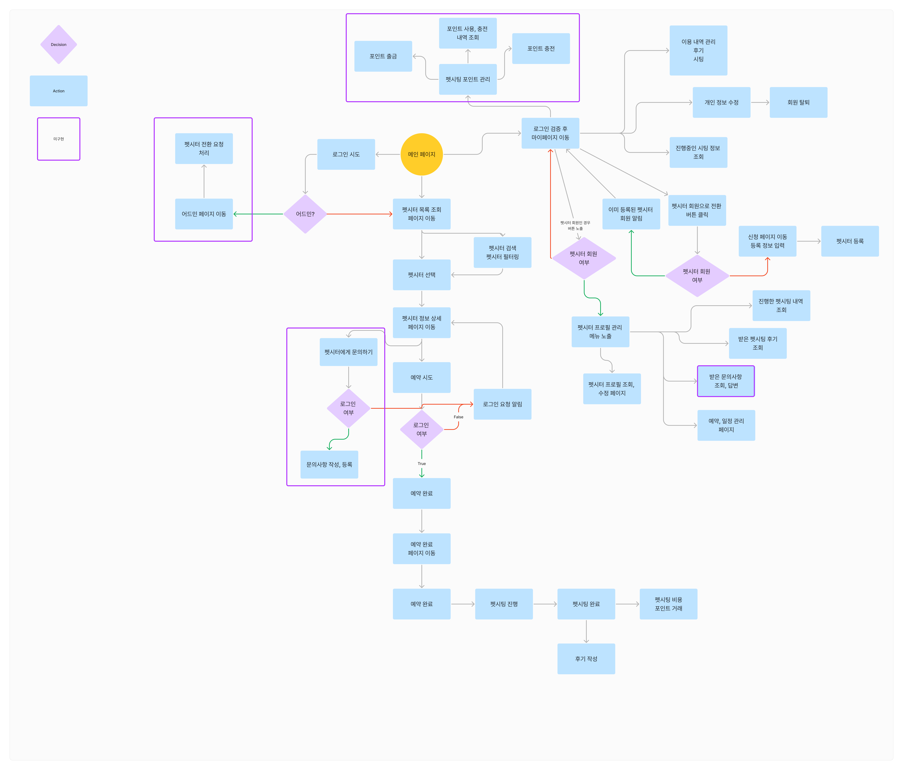
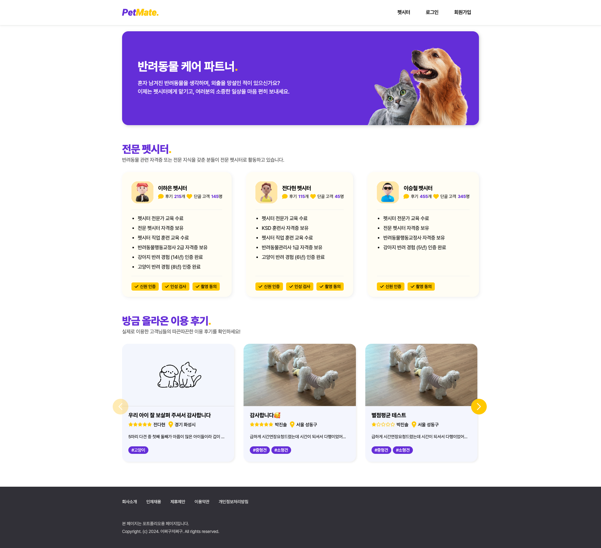
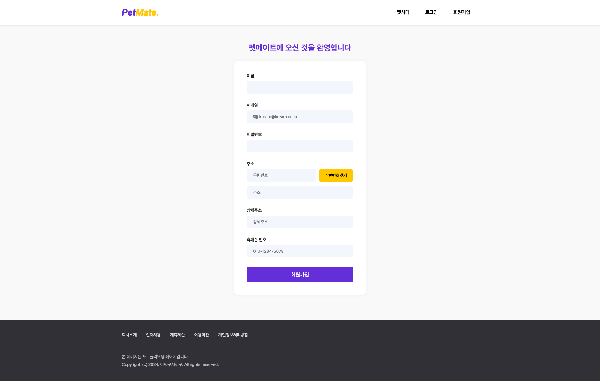
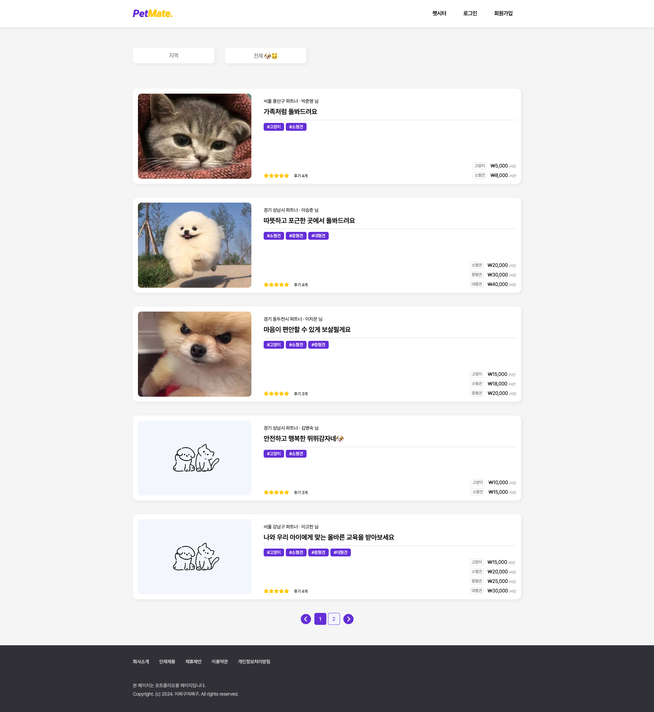
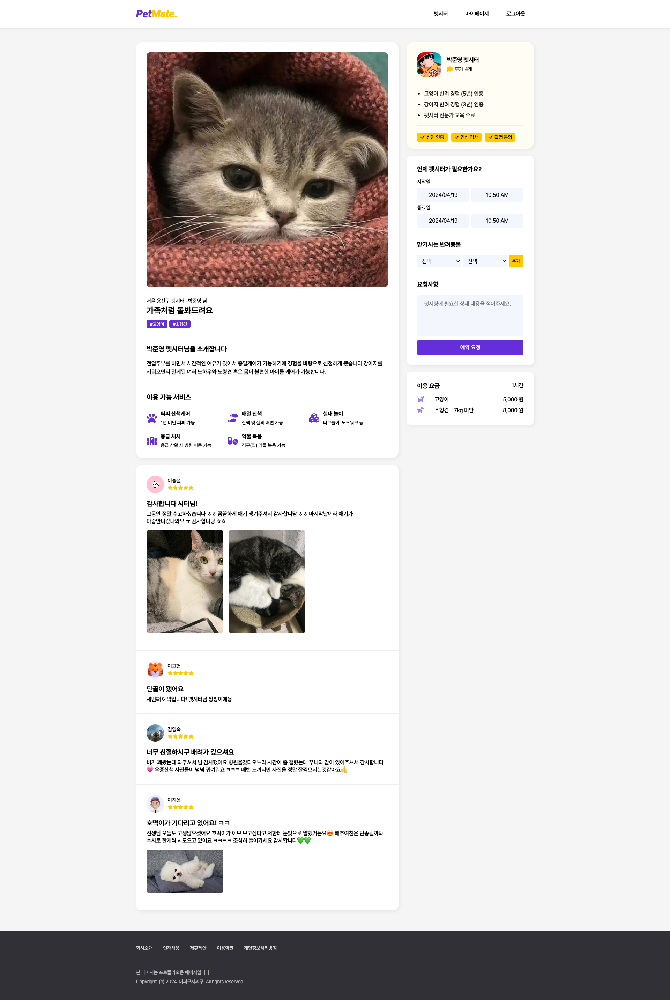
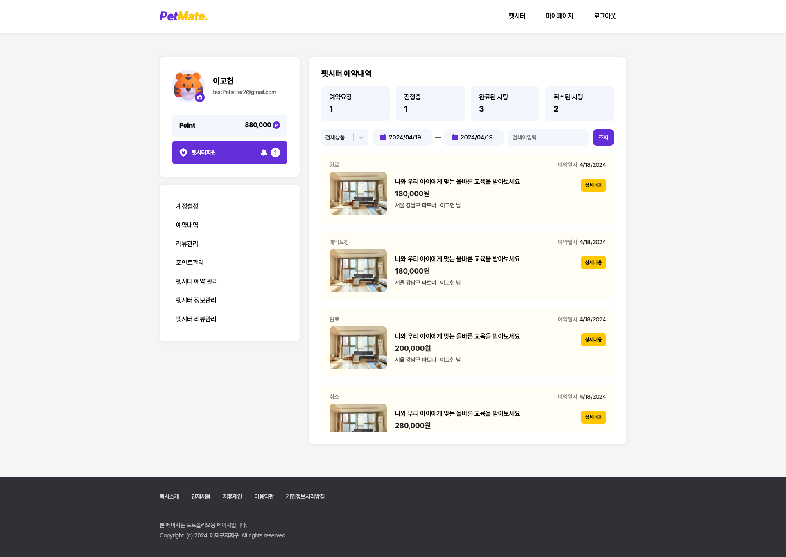
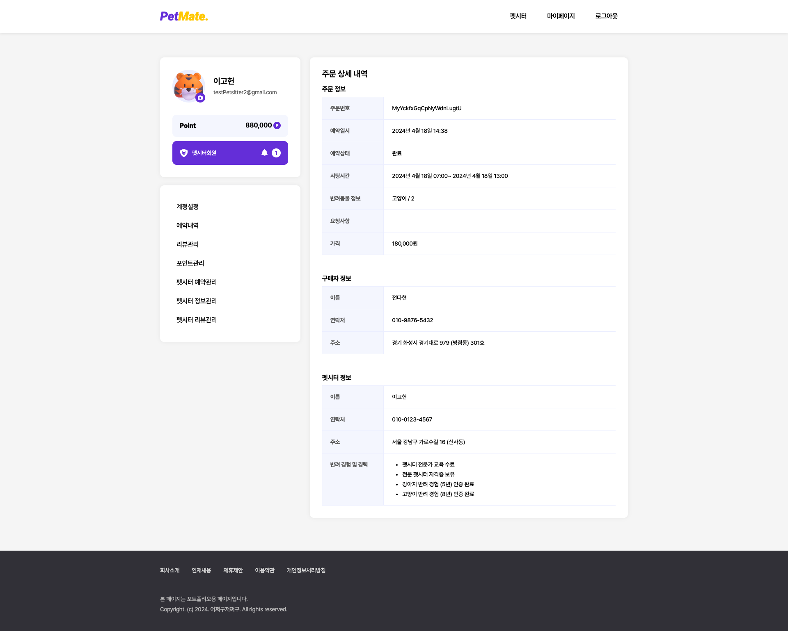
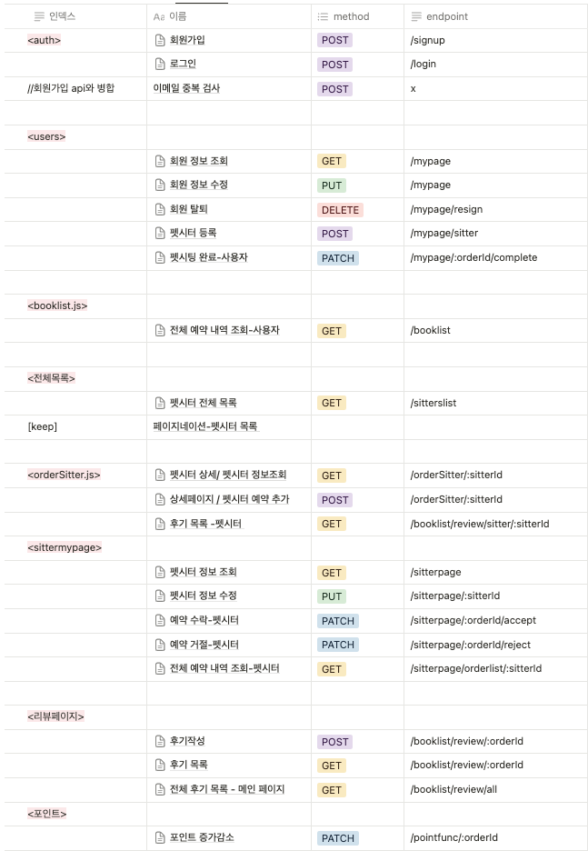

<h1 style="color: #632ed8; font-style: italic;">PetMate.</h1>

    
    
펫시터가 필요한 사용자와 펫시터를 연결해주는 플랫폼 서비스

##

### 프로젝트 기간  
3주  
2024.4.1(월) ~ 2024.4.19(금)

### 프로젝트 설명  
펫메이트는 펫시팅을 맡기는 사용자와 펫시터의 중개 역할을 합니다.  
사용자는 펫시팅을 펫시터에게 예약할 수 있고  
펫시터로 전환하여 사용자들에게 펫시팅을 제공할 수 있습니다.  
사용자 간의 펫시팅 날짜와 시간을 설정해 예약 요청, 수락, 거절, 완료 처리와  
펫시팅을 완료한 후 리뷰를 주고 받을 수 있습니다.  
사용자에게 펫시터의 지역, 펫시팅 종류에 따른 필터링을 제공합니다.

### 팀 소개
> **엘리스 소프트웨어 트랙 8기 2차 프로젝트 4팀**  
>  
> **_front-end_**  
박진솔, 신창건, 이고헌, 이승철  
**_back-end_**  
 전다현, 이하은

## 프로젝트 상세

### 기술스택

**협업 도구 및 환경**  
 
  

**공통**  

  

> **프론트엔드**  
>  
>  
>  
>   
> **백엔드**  
>   

**Lint 도구**  

## 시작 가이드

### 요구사항  
Node.js 20.12.0   npm 10.5.0

### 설치 및 실행

0. git clone project  
    프론트엔드:  
    백엔드:
1. npm install
2. .env 설정  
    >front-end server: PORT,  
     back-end server:  
     PORT, DB_ID, DB_PW, SECRET_KEY,   
     AWS_KEY, AWS_SECRET_KEY
    
3. npm run dev

##

### 렌더링 방식  
하이브리드 렌더링  
Vite로 빌드된 앱을 Express 서버에서 클라이언트 요청에 SSR하여 응답하고 클라이언트 측 앱 내에서 동적으로 백엔드 서버에 데이터를 요청해 CSR

### 주요 기능  
· 펫시터 필터링 조회  
· 펫시터에게 예약 요청 및 진행  
· 펫시터 회원 전환, 프로필 등록 및 수정  
·   

### 플로우 차트

### 화면구성  
<table>
    <tr>
        <td>메인</td>
        <td>회원가입</td>
    </tr>
    <tr>
        <td></td>
        <td></td>
    </tr>
    <tr>
        <td>펫시터 목록</td>
        <td>펫시터 상세</td>
    </tr>
    <tr>
        <td></td>
        <td></td>
    </tr>
    <tr>
        <td>마이페이지</td>
        <td>예약 상세</td>
    </tr>
    <tr>
        <td></td>
        <td></td>
    </tr>
</table>

### API구성

